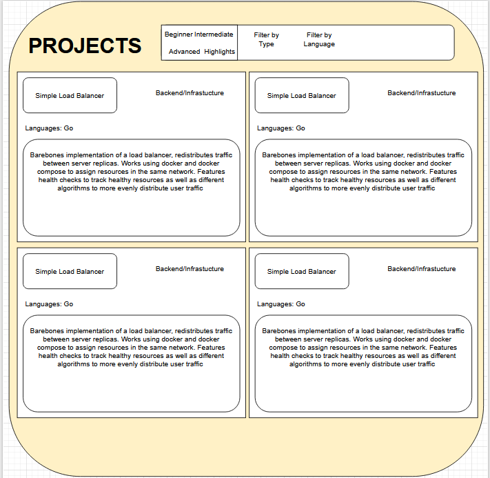
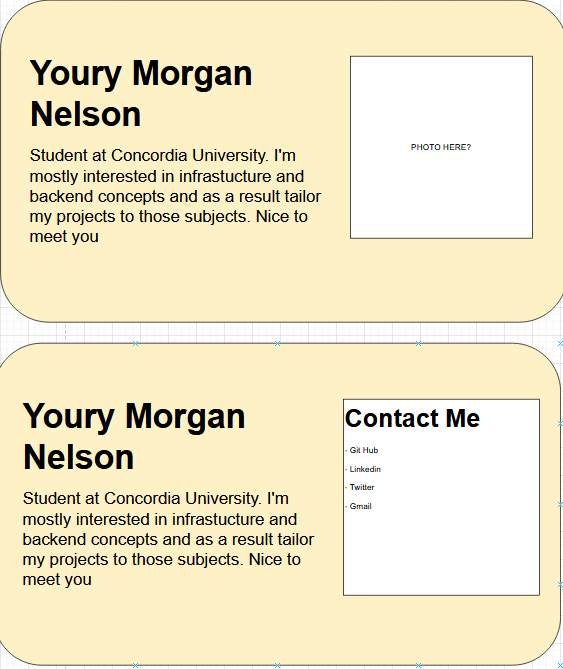

# Planning

This is where I write down my thoughts for what I want to show off for this website

## What do I want to show off?

- My projects
- Skills developped over the years
- Github Contributions
- Interests

## Design of the website

I'll go with a light beige for now, it doesn't need a lot of colors

## How do I want to show off each section?

### Projects

Characteristics:

- Filter options  
  - By type
  - By language
  - By Size and complexity of the project
  
- Project Details
  - Type of project (Backend, Frontend, Infrastucture, etc)
  - Languages Used
  - Name
  - Description
  - Main Technologies used

### About me

Characteristics:

- Name
- Description

- Photo OR contact section

### Skills

Characteristics:

There will be sub sections for the following:

- Programming Languages
  - Ex: JS, Python, C#, Java, SQL/PLSQL, Golang, C/C++  
- Backend Frameworks
  - EX: Express.js, Node.js, Flask, Entity Framework, JDBC
- Frontend Frameworks
  - React, Avalonia
- Databases
  - Oracle Developper, MongoDB, PostgreSQL
- Machine Learning
  - Ex: Scikit Learn, YOLOV8, PyTorch
- Dev Tools
  - Linux, AWS, Nginx, Docker, CI/CD, Git, Asure, VPNs (Wireguard)